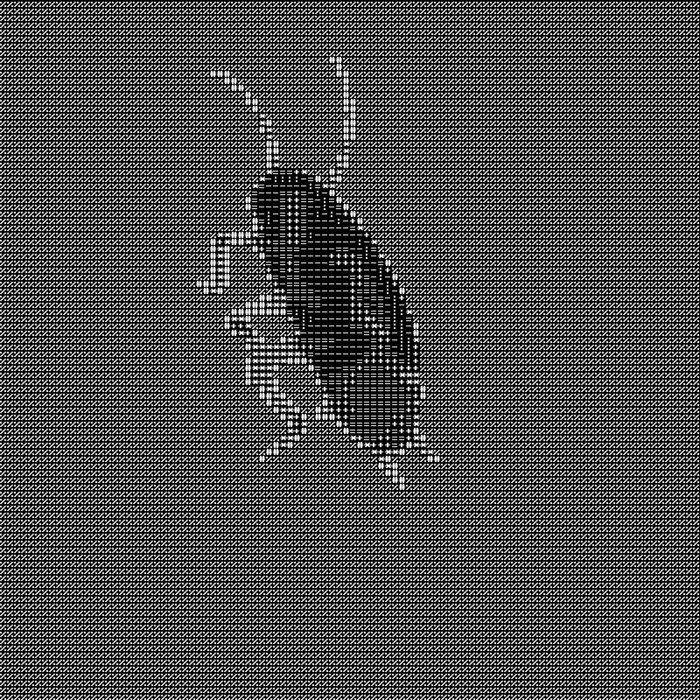

# GIF to ASCII Converter

A high-performance C++ tool that converts standard animated GIFs into fully rendered ASCII art animations. 

Instead of just printing ASCII characters to the console, this program processes the video frame-by-frame, maps pixel brightness to ASCII characters, and renders a completely new GIF file using a custom TrueType font (`.ttf`).

## 🎬 Demonstration

| Original GIF | ASCII Art Result |
| :---: | :---: |
|  |  |

*(Font used in demonstration: `Mx437_IBM_BIOS.ttf`)*

## Features

* **Native FFmpeg Integration:** Uses `libavcodec` and `libavformat` for fast, low-level video decoding and encoding.
* **Smart Scaling:** Utilizes `libswscale` to downsample frames into a grid (e.g., 100x100 characters) while preserving grayscale brightness data.
* **Custom Font Rendering:** Uses **SFML** to draw ASCII characters onto a virtual canvas using any custom `.ttf` monospace font.
* **Dynamic Frame Rate:** Automatically detects the original GIF's FPS and applies the exact same framerate to the output file.
* **RAII Architecture:** Clean, memory-safe OOP design in C++ preventing memory leaks during complex FFmpeg buffer operations.

## Prerequisites

To build and run this project, you need **CMake**, a C++17 compiler, **FFmpeg** libraries, and **SFML**. 

On Ubuntu/Debian, you can install all dependencies via:

```bash
sudo apt update
sudo apt install build-essential cmake pkg-config \
                 libavformat-dev libavcodec-dev libavutil-dev libswscale-dev \
                 libsfml-dev
```

## Build on Windows (via MSYS2)

The easiest way to build this project on Windows is using MSYS2, which provides a Unix-like environment and package manager.

1. Download and install [MSYS2](https://www.msys2.org/).
2. Open the **MSYS2 UCRT64** terminal.
3. Install the required toolchain and dependencies:
   ```bash
   pacman -S mingw-w64-ucrt-x86_64-gcc mingw-w64-ucrt-x86_64-cmake mingw-w64-ucrt-x86_64-pkgconf mingw-w64-ucrt-x86_64-ffmpeg mingw-w64-ucrt-x86_64-sfml